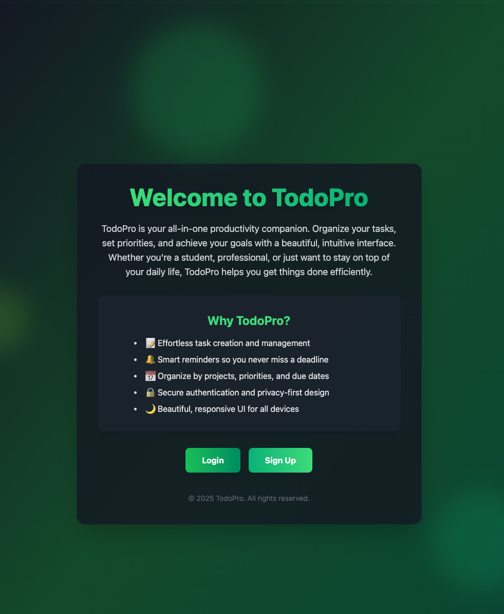

# TodoPro – MERN Stack Todo App

A modern, full-stack Todo application built with the MERN stack (MongoDB, Express, React, Node.js). Features robust authentication, email verification, password reset via code, and a beautiful, responsive UI.

---

## Table of Contents

- [TodoPro – MERN Stack Todo App](#todopro--mern-stack-todo-app)
  - [Table of Contents](#table-of-contents)
  - [Features](#features)
  - [Tech Stack](#tech-stack)
  - [Screenshots](#screenshots)
  - [Getting Started](#getting-started)
    - [Backend Setup](#backend-setup)
    - [Frontend Setup](#frontend-setup)
  - [Environment Variables](#environment-variables)
    - [Backend (`backend/.env`)](#backend-backendenv)
    - [Frontend (`frontend/.env`)](#frontend-frontendenv)
  - [API Endpoints](#api-endpoints)
    - [Auth](#auth)
    - [Todos](#todos)
  - [Deployment](#deployment)
  - [License](#license)
  - [Author](#author)
  - [Acknowledgements](#acknowledgements)

---

## Features

- User registration with email verification (Resend API)
- Secure login/logout with JWT & cookies
- Password reset via email code (no reset link)
- Resend verification and reset codes
- Responsive, modern UI (React, Tailwind CSS)
- Protected routes and state management (Zustand)
- CRUD for todos (add, edit, delete, mark complete)
- Professional error handling and user feedback

## Tech Stack

- **Frontend:** React 19, Vite, Zustand, Axios, Tailwind CSS, Lucide React Icons
- **Backend:** Node.js, Express 5, MongoDB (Mongoose), JWT, Resend (email)
- **Other:** Render.com (deployment), dotenv, CORS, cookie-parser

## Screenshots



---

## Getting Started

### Backend Setup

1. `cd backend`
2. Install dependencies:
   ```bash
   npm install
   ```
3. Create a `.env` file (see [Environment Variables](#environment-variables))
4. Start the server (dev):
   ```bash
   npm run dev
   ```

### Frontend Setup

1. `cd frontend`
2. Install dependencies:
   ```bash
   npm install
   ```
3. Create a `.env` file (see [Environment Variables](#environment-variables))
4. Start the dev server:
   ```bash
   npm run dev
   ```

---

## Environment Variables

### Backend (`backend/.env`)

```
PORT=4000
MONGO_URI=your_mongodb_connection_string
JWT_SECRET=your_jwt_secret
RESEND_API_KEY=your_resend_api_key
CLIENT_URL=http://localhost:5173
```

### Frontend (`frontend/.env`)

```
VITE_API_URL=http://localhost:4000
```

---

## API Endpoints

### Auth

- `POST /api/auth/signup` – Register new user
- `POST /api/auth/login` – Login
- `POST /api/auth/logout` – Logout
- `POST /api/auth/verify-email` – Verify email with code
- `POST /api/auth/resend-verification` – Resend verification code
- `POST /api/auth/forgot-password` – Request password reset code
- `POST /api/auth/reset-password-by-code` – Reset password with code
- `GET /api/auth/check-auth` – Check authentication (protected)

### Todos

- `GET /api/todo` – Get all todos (protected)
- `POST /api/todo` – Add todo (protected)
- `PUT /api/todo/:id` – Update todo (protected)
- `DELETE /api/todo/:id` – Delete todo (protected)

---

## Deployment

- The app is ready for deployment on platforms like Render.com.
- Build frontend: `cd frontend && npm run build`
- The backend serves the frontend build in production mode.
- Set all environment variables in your deployment dashboard.

---

## License

This project is licensed under the MIT License.

---

## Author

- [Your Name](https://github.com/gutujir)

---

## Acknowledgements

- [Resend](https://resend.com/) for transactional email
- [MongoDB](https://www.mongodb.com/), [Render](https://render.com/), [Vite](https://vitejs.dev/)

---

> For any questions or issues, please open an issue or contact the maintainer.
